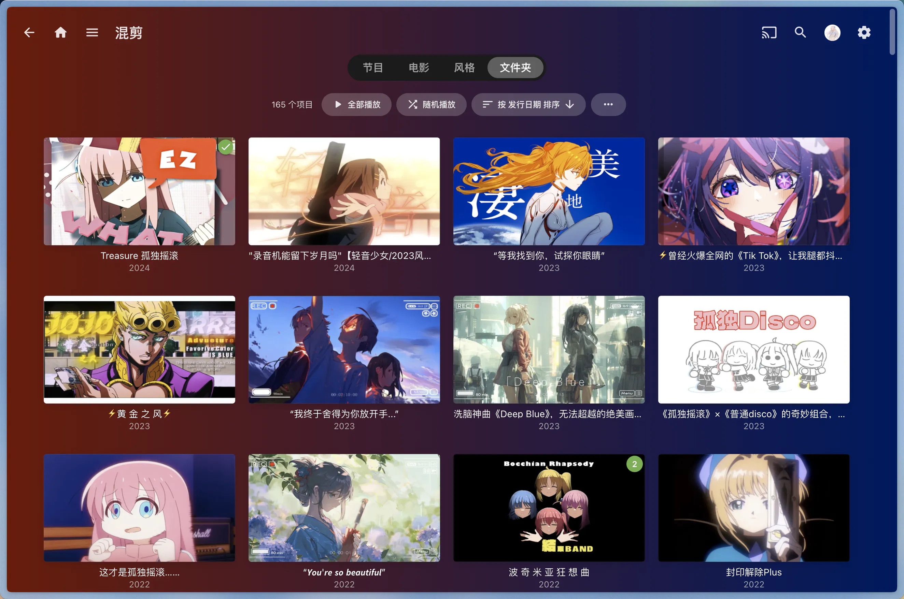

## 简介

> [!NOTE]
> [点击此处](https://bili-sync.allwens.work/)查看文档

bili-sync 是一款专为 NAS 用户编写的哔哩哔哩同步工具，由 Rust & Tokio 驱动。

## 效果演示

### 概览

### 详情

### 播放（使用 infuse）

### 文件排布

## 功能与路线图

- [x] 使用用户填写的凭据认证，并在必要时自动刷新
- [x] 可以在管理页面0.0.0.0:12345内添加视频源
- [x] 支持收藏夹与视频列表/视频合集的下载
- [x] 支持番剧的下载，包括单季模式和全季模式
- [x] 自动选择用户设置范围内最优的视频和音频流，并在下载完成后使用 FFmpeg 合并
- [x] 使用 Tokio 与 Reqwest，对视频、视频分页进行异步并发下载
- [x] 使用媒体服务器支持的文件命名，方便一键作为媒体库导入
- [x] 当前轮次下载失败会在下一轮下载时重试，失败次数过多自动丢弃
- [x] 使用数据库保存媒体信息，避免对同个视频的多次请求
- [x] 打印日志，并在请求出现风控时自动终止，等待下一轮执行
- [x] 提供多平台的二进制可执行文件，为 Linux 平台提供了立即可用的 Docker 镜像
- [x] 支持对"稍后再看"内视频的自动扫描与下载
- [x] 支持对 UP 主投稿视频的自动扫描与下载
- [x] 支持限制任务的并行度和接口请求频率
- [ ] 下载单个文件时支持断点续传与并发下载

## 参考与借鉴

该项目实现过程中主要参考借鉴了如下的项目，感谢他们的贡献：

+ [bilibili-API-collect](https://github.com/SocialSisterYi/bilibili-API-collect) B 站的第三方接口文档
+ [bilibili-api](https://github.com/Nemo2011/bilibili-api) 使用 Python 调用接口的参考实现
+ [danmu2ass](https://github.com/gwy15/danmu2ass) 本项目弹幕下载功能的缝合来源
