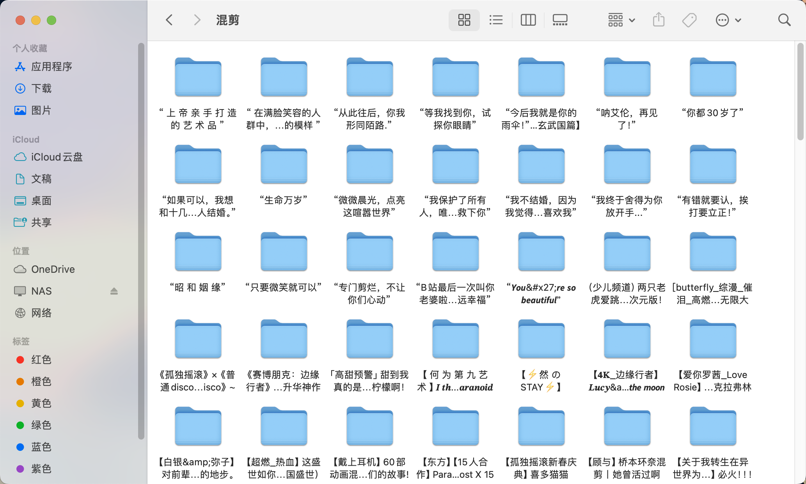

## 简介

> [!NOTE]
> 此为 v2.x 版本文档，v1.x 版本文档请前往[此处](https://github.com/amtoaer/bili-sync/tree/v1.x)查看。


为 NAS 用户编写的 BILIBILI 收藏夹同步工具，可使用 EMBY 等媒体库工具浏览。

支持展示视频封面、名称、加入日期、标签、分页等。


## 效果演示

**注：因为可能同时存在单页视频和多页视频，媒体库类型请选择“混合内容”。**

### 概览

### 详情

### 播放（使用 infuse）

### 文件排布


## 配置文件说明

> [!NOTE]
> 在 Docker 环境中，`~` 会被展开为 `/app`。

程序默认会将配置文件存储于 `~/.config/bili-sync/config.toml`，数据库文件存储于 `~/.config/bili-sync/data.sqlite`，如果发现不存在会新建并写入默认配置。

配置文件加载时会进行简单校验，默认配置无法通过校验，程序会报错终止运行。

可以下载程序后直接运行程序，看到报错后参考报错信息对默认配置进行修改，修改正确后即可正常运行。

对于配置文件中的 `credential`，请参考[凭据获取流程](https://nemo2011.github.io/bilibili-api/#/get-credential)。

配置文件中的 `video_name` 和 `page_name` 支持使用模板，模板的替换语法请参考示例。模板中的内容在执行时会被动态替换为对应的内容。

video_name 支持设置 bvid（视频编号）、title（视频标题）、upper_name（up 主名称）、upper_mid（up 主 id）。

page_name 除支持 video 的全部参数外，还支持 ptitle（分 P 标题）、pid（分 P 页号）。

对于每个 favorite_list 的下载路径，程序会在其下建立如下的文件夹：

1. 单页视频：

    ```bash
    ├── {video_name}
    │   ├── {page_name}.mp4
    │   ├── {page_name}.nfo
    │   └── {page_name}-poster.jpg
    ```

2. 多页视频：

    ```bash
    ├── {video_name}
    │   ├── poster.jpg
    │   ├── Season 1
    │   │   ├── {page_name} - S01E01.mp4
    │   │   ├── {page_name} - S01E01.nfo
    │   │   ├── {page_name} - S01E01-thumb.jpg
    │   │   ├── {page_name} - S01E02.mp4
    │   │   ├── {page_name} - S01E02.nfo
    │   │   └── {page_name} - S01E02-thumb.jpg
    │   └── tvshow.nfo
    ```

对于 filter_option 的可选值，请前往 [analyzer.rs](https://github.com/amtoaer/bili-sync/blob/main/src/bilibili/analyzer.rs) 查看。

对于 danmaku_option 的项含义，请前往 [danmaku/mod.rs](https://github.com/amtoaer/bili-sync/blob/main/src/bilibili/danmaku/canvas/mod.rs) 与 [原项目的说明](https://github.com/gwy15/danmu2ass?tab=readme-ov-file#%E5%91%BD%E4%BB%A4%E8%A1%8C) 查看。

## 配置文件示例

```toml
# 视频所处文件夹的名称
video_name = "{{title}}"
# 视频分页文件的命名
page_name = "{{bvid}}"
# 扫描运行的间隔（单位：秒）
interval = 1200
# emby 演员信息的保存位置
upper_path = "/home/amtoaer/.config/nas/emby/metadata/people/"

[credential]
# Bilibili 的 Web 端身份凭据，需要凭据才能下载高清视频
sessdata = ""
bili_jct = ""
buvid3 = ""
dedeuserid = ""
ac_time_value = ""

[filter_option]
# 视频、音频流的筛选选项，程序会使用范围内质量最高的流
# 注意设置范围过小可能导致无满足条件的流，推荐仅调整质量上限和编码优先级
video_max_quality = "Quality8k"
video_min_quality = "Quality360p"
audio_max_quality = "QualityHiRES"
audio_min_quality = "Quality64k"
codecs = [
    "AV1",
    "HEV",
    "AVC",
]
no_dolby_video = false
no_dolby_audio = false
no_hdr = false
no_hires = false

[danmaku_option]
# 弹幕的一些相关选项，如字体、字号、透明度、停留时间、是否加粗等
duration = 12.0
font = "黑体"
font_size = 25
width_ratio = 1.2
horizontal_gap = 20.0
lane_size = 32
float_percentage = 0.5
bottom_percentage = 0.3
opacity = 76
bold = true
outline = 0.8
time_offset = 0.0

[favorite_list]
# 收藏夹 ID = 存储的位置
52642258 = "/home/amtoaer/HDDs/Videos/Bilibilis/混剪"
```

## Docker Compose 文件示例

该项目为 `Linux/amd64` 与 `Linux/arm64` 提供了 Docker 版本镜像。

Docker 版包含该平台对应版本的可执行文件（位于`/app/bili-sync-rs`），并预装了 FFmpeg，其它用法与普通版本完全一致。（可查看 [用于构建镜像的 Dockerfile](./Dockerfile) ）

以下是一个 Docker Compose 的编写示例：
```yaml
services:
  bili-sync-rs:
    image: amtoaer/bili-sync-rs:v2.0.0
    restart: unless-stopped
    network_mode: bridge
    tty: true  # 该选项请仅在日志终端支持彩色输出时启用，否则日志中可能会出现乱码
    # user: 1000:1000  # 非必需设置项，说明见下
    hostname: bili-sync-rs
    container_name: bili-sync-rs
    volumes:
      - /home/amtoaer/.config/nas/bili-sync-rs:/app/.config/bili-sync
      # 以及一些其它必要的挂载，确保此处的挂载与 bili-sync-rs 的配置相匹配
      # ...
    logging:
      driver: "local"
```
### user 的设置
- 可设置为宿主机适当用户的 uid 及 gid (`$uid:$gid`)，使项目下载的文件的所有者与该处设置的用户保持一致，不设置默认为 root
- 执行 `id ${user}` 以获得 `user` 用户的 uid 及 gid ，了解更多可参阅 [Docker文档](https://docs.docker.com/engine/reference/run/#user)

## 路线图

- [x] 凭证认证
- [x] 视频选优
- [x] 视频下载
- [x] 支持并发下载
- [x] 支持作为 daemon 运行
- [x] 构建 nfo 和 poster 文件，方便以单集形式导入 emby
- [x] 支持收藏夹翻页，下载全部历史视频
- [x] 对接数据库，提前检查，按需下载
- [x] 支持弹幕下载
- [x] 更好的错误处理
- [x] 更好的日志
- [x] 请求过快出现风控的 workaround
- [x] 提供简单易用的打包（如 docker）
- [ ] 支持 UP 主合集下载

## 参考与借鉴

该项目实现过程中主要参考借鉴了如下的项目，感谢他们的贡献：

+ [bilibili-API-collect](https://github.com/SocialSisterYi/bilibili-API-collect) B 站的第三方接口文档
+ [bilibili-api](https://github.com/Nemo2011/bilibili-api) 使用 Python 调用接口的参考实现
+ [danmu2ass](https://github.com/gwy15/danmu2ass) 本项目弹幕下载功能的缝合来源
