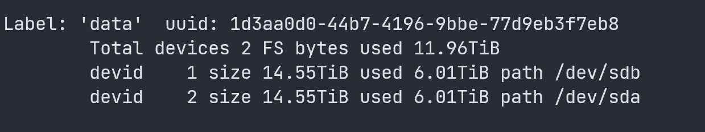
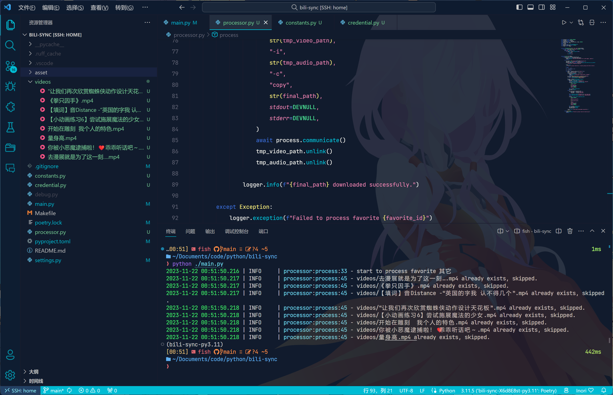

## 简介

为 NAS 用户编写的 BILIBILI 收藏夹同步工具，可方便导入 EMBY 等媒体库工具浏览。

> 经常在点进自己的收藏夹时看到一大堆失效视频，简直逼死强迫症。想到自己 NAS 还有多余的 20T 存储空间，于是简单写了一个小工具用来实时把收藏夹内容同步下载到 NAS 上。
> 

骄傲地由 python 驱动！

~~之前基本没有用过 python 的 asyncio，拿这个小工具练练手！（不是~~

## 工作截图




## 配置文件

对于配置文件的前五项，请参考[凭据获取流程](https://nemo2011.github.io/bilibili-api/#/get-credential)。

```python
class Config(DataClassJsonMixin):
    sessdata: str = ""
    bili_jct: str = ""
    buvid3: str = ""
    dedeuserid: str = ""
    ac_time_value: str = ""
    interval: int = 20    # 任务执行的间隔时间
    favorite_ids: list[int] = field(default_factory=list)  # 收藏夹的 id
    path_mapper: dict[int, str] = field(default_factory=dict)  # 收藏夹的 id 到存储目录的映射
```

程序默认会将配置文件存储于 `${程序路径}/config/config.json`，数据库文件存储于 `${程序路径}/data/data.db`，如果发现不存在则新建并写入初始配置。

配置文件加载时会校验内容是否为空，对于默认的空配置，校验将会报错，程序将会终止运行。

即：我们可以通过运行一次程序，等程序写入初始配置并提示配置错误终止后编辑 `config.json` 文件，编辑后即可重新运行。


## Docker 运行示例

docker compose 文件：
```yaml
services:
  bili-sync:
    image: amtoaer/bili-sync:latest
    user: 1000:1000  # 此处可以指定以哪个用户的权限运行，不填写的话默认 root，推荐填写。
    tty: true  # 加上这一行可以让日志变成彩色
    volumes:
      - /home/amtoaer/Videos/Bilibilis/:/Videos/Bilibilis/  # 视频文件
      - /home/amtoaer/.config/nas/bili-sync/config/:/app/config/  # 配置文件
      - /home/amtoaer/.config/nas/bili-sync/data/:/app/data/  # 数据库
      # 注：如需在 emby 内查看 up 主头像，需要将 emby 的 metadata/people/ 配置目录挂载至容器的 /app/thumb/
      - /home/amtoaer/.config/nas/emby/metadata/people/:/app/thumb/
    environment:
      - TZ=Asia/Shanghai
    restart: always
    network_mode: bridge
    hostname: bili-sync
    container_name: bili-sync
    logging:
      driver: "local"
```

对应的配置文件：

```json
{
    "sessdata": "xxxxxxxxxxxxxxxxxx",
    "bili_jct": "xxxxxxxxxxxxxxxxxx",
    "buvid3": "xxxxxxxxxxxxxxxxxx",
    "dedeuserid": "xxxxxxxxxxxxxxxxxx",
    "ac_time_value": "xxxxxxxxxxxxxxxxxx",
    "interval": 20,
    "favorite_ids": [
        711322958
    ],
    "path_mapper": {
        "711322958": "/Videos/Bilibilis/Bilibili-711322958/"
    }
}
```

## 支持的额外命令

为满足需要，该应用包含几个单独的命令，可在程序目录下使用 `python entry.py ${command name}` 运行。

1. `once`

    处理收藏夹，和一般定时任务触发时执行的操作完全相同，但仅运行一次。
2. `recheck` 

    将本地不存在的视频文件标记成未下载，下次定时任务触发时将一并下载。
3. `refresh_refresh_poster`

    更新本地视频的封面。
3. `refresh_upper`

    更新本地up的头像和元数据。
3. `refresh_nfo`

    更新本地视频的元数据。（如标签、标题等信息）
3. `refresh_video`

    更新本地的视频源文件。
3. `refresh_subtitle`

    更新本地的弹幕文件。

**对于以 refresh 开头的命令，均支持 --force 参数，如果有 --force 参数，将全量覆盖对应内容，否则默认仅更新缺失的部分。**

## 路线图

- [x] 凭证认证
- [x] 视频选优
- [x] 视频下载
- [x] 支持并行下载
- [x] 支持作为 daemon 运行
- [x] 构建 nfo 和 poster 文件，方便以单集形式导入 emby
- [x] 支持收藏夹翻页，下载全部历史视频
- [x] 对接数据库，提前检查，按需下载
- [x] 提供简单易用的打包（如 docker）
