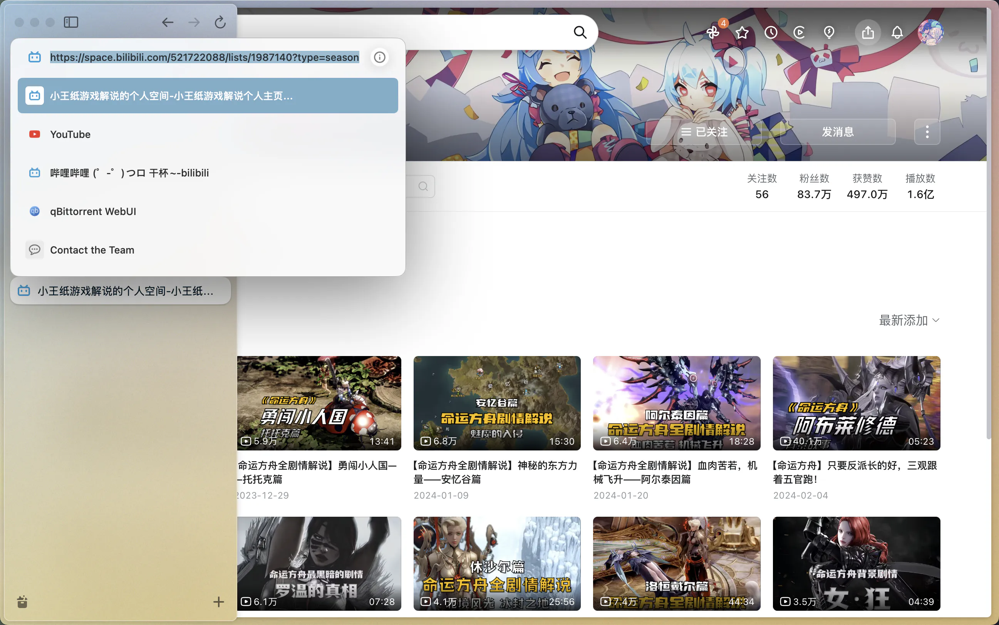
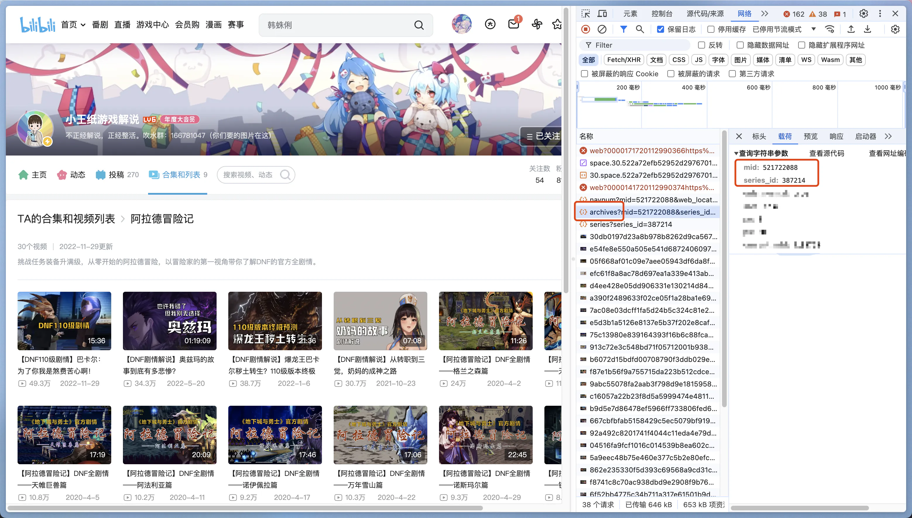

# 获取视频合集/视频列表信息

视频合集和视频列表虽然在哔哩哔哩网站交互上行为类似，但在接口层级是两个不同的概念，程序配置中需要对两者做出区分。

## 配置形式与区分方法

在 bili-sync 的设计中，视频合集的 key 为 `season:{mid}:{season_id}`，而视频列表的 key 为 `series:{mid}:{series_id}`。

新版本 b 站网页端已经对两种类型做了初步整合，将需要的参数展示在了视频合集/视频列表的 URL 中，不再需要手动查看接口。URL 的路径格式为：


```
/{mid}/lists/{id}?type={season/series}
```

点开你想要订阅的视频合集/视频列表详情，查看 URL 即可拼接出对应的 key。

### 视频合集



该视频合集的 key 为 `season:521722088:1987140`。

### 视频列表



该视频列表的 key 为 `series:521722088:387214`。