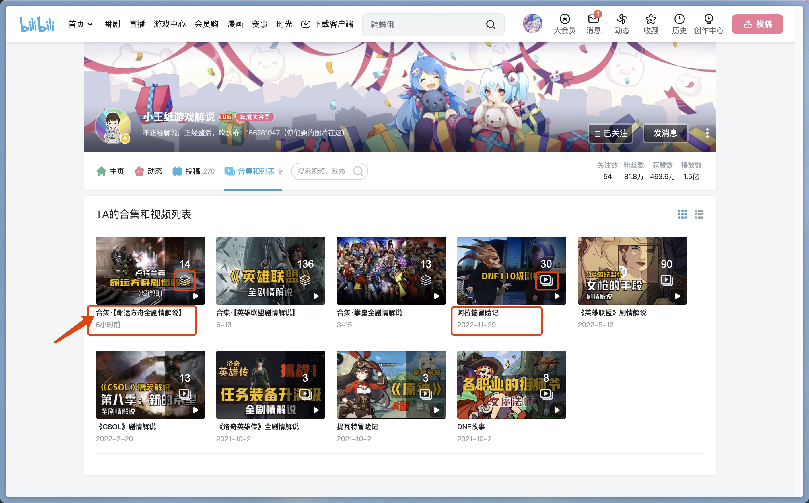
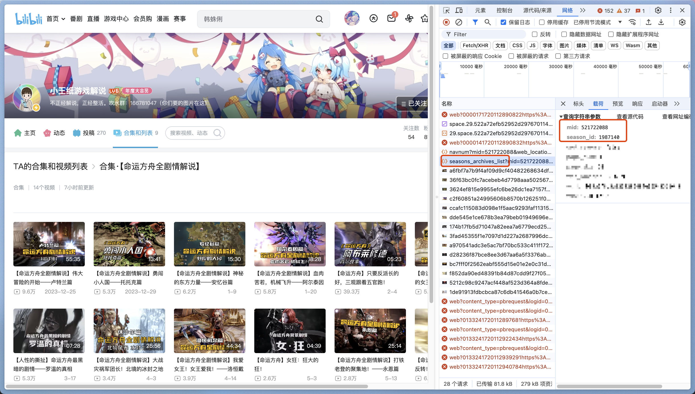
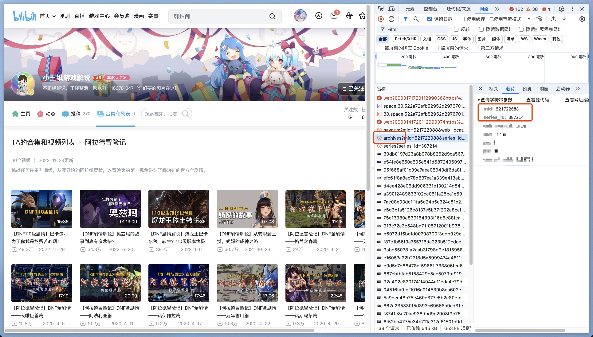

# 获取视频合集/视频列表信息

要说明的是，视频合集和视频列表虽然在哔哩哔哩网站交互上行为类似，但在接口层级是两个不同的概念。可以简单将视频列表理解为一个老旧版本的视频合集。

在调试过程中我注意到视频列表的 ID 可以通过某种规则转换为视频合集的 ID，从而成功调用视频合集的接口，但由于不清楚具体的转换策略，在 bili-sync 的实现中还是将其当成两种类型处理。

## 区分方法

这两种类型可以很容易地通过如下手段区分：
1. 两者的名称前缀不同，视频合集会有显式的“合集”字样
2. 两者的图标不同

如下图所示，“合集【命运方舟全剧情解说】”是视频合集，而“阿拉德冒险记”是视频列表。

在 bili-sync 的设计中，视频合集的 key 为 `season:{mid}:{season_id}`，而视频列表的 key 为 `series:{mid}:{series_id}`。

## 参数获取

了解了区分方法后，我们可以通过如下步骤获取视频合集/视频列表的信息。

### 视频合集

该视频合集的 key 为 `season:521722088:1987140`。

### 视频列表

该视频列表的 key 为 `series:521722088:387214`。