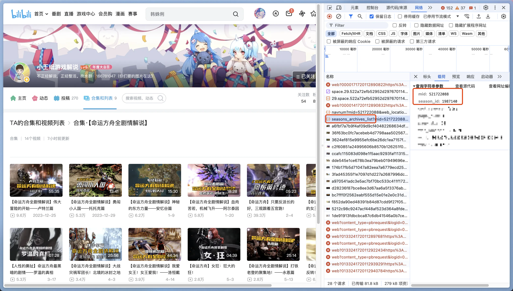

# 获取合集/列表信息

视频合集和视频列表虽然在哔哩哔哩网站交互上行为类似，但在接口层级是两个不同的概念，程序配置中需要对两者做出区分。

目前 B 站绝大部分内容都是视频合集（Season），视频列表（Series）是古早的功能，现在已经不常见了。

## 配置形式与区分方法

新版本 b 站网页端已经对两种类型做了初步整合，将需要的参数展示在了视频合集/视频列表的 URL 中，不再需要手动查看接口。URL 的路径格式为：


```
/{mid}/lists/{id}?type={season/series}
```

点开你想要订阅的视频合集/视频列表详情，对照查看 URL 即可获取所需参数。

### 视频合集



类型为 `合集（Season）`，用户 ID 为 `521722088`，合集 ID 为 `1987140`。

### 视频列表


类型为 `列表（Series）`，用户 ID 为 `521722088`，列表 ID 为 `387214`。
